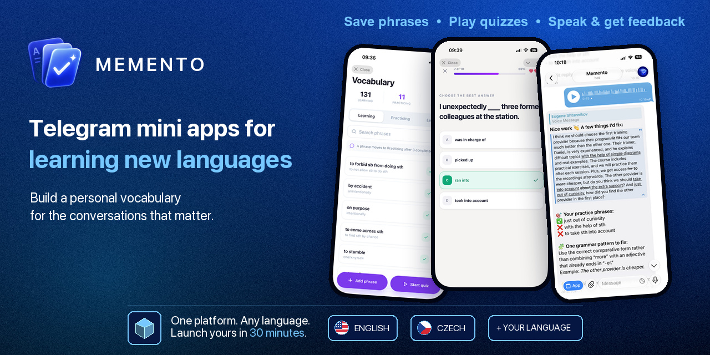

## About

After moving to Europe, I had to learn two languages at once. I needed English for work and Czech for everyday life. New words and phrases quickly filled my notes and chats, but they rarely made it into active speech.

That is why I built Memento, a mini app for Telegram. Save phrases, learn them through short quizzes, and practice using them in conversation. Memento remembers every phrase and tracks your progress. Unlike ChatGPT on its own, Memento enables spaced repetition: it knows what you have learned and what is due for review.

I needed two languages from day one, so I built Memento as a platform with a simple idea: one language = one Telegram app. Anyone can add a new language and launch a dedicated app. With an AI coding agent, it takes about 30 minutes.

## Telegram apps

The platform currently powers two independent Telegram apps:

| App | Learning language | Mini App route | Speaking practice |
| --- | --- | --- | --- |
| [**Memento**](https://t.me/mementoxbot) | English | `/` | Available |
| [**Pomněnka**](https://t.me/pomnenkaxbot) | Czech | `/cz` | Not enabled yet |

They feel like separate apps to learners, but behind the scenes both run on the same platform.

## One platform, any language

Each app gets its own language pack. It defines the parts that make the app unique:

- app name, locale, route, and Telegram bot configuration;
- starter vocabulary;
- prompts for quiz generation and grading;
- prompts for speech transcription and speaking-practice feedback;
- language-specific eval cases.

Everything else is shared: the Mini App interface, vocabulary progress, quizzes, speaking practice, storage, and deployment. The language registry connects each pack to this shared platform. App IDs keep data separate, while each Telegram bot provides its own entry point.

Adding a language does not require a fork. Follow [Language apps](docs/language-apps.md) for the platform conventions. AI agents should use the [add-memento-language skill](.agents/skills/add-memento-language/SKILL.md) for the full Stage-to-Production rollout.

## License

Memento is available under the [MIT License](LICENSE).
